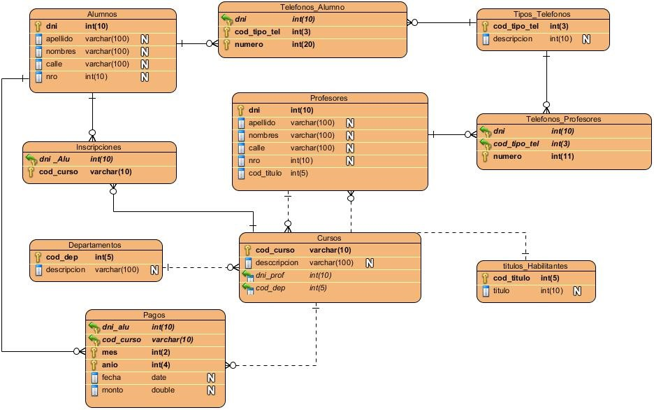

## Prueba Técnica

### PARTE 1

1. **Crear Base de Datos:**
   - Crear una base de datos llamada ‘prueba_tecnica’ e importar el script que se encuentra en la carpeta `parte_1`.
   
2. **Consultas SQL:**
   - **Obligatorio:** Obtener la lista de alumnos y sus cursos.
   - **Extra:** Obtener la lista de alumnos que no han pagado la cuota del mes 6 del año 2023 del curso Desarrollo Back End.

### PARTE 2

- Desarrollar una función en el lenguaje preferido basada en el módulo de ejemplo ‘endpoint.php’ ubicado en la carpeta `parte_2`.
- Utilizando la consulta obligatoria de la parte anterior en lugar de ‘<consulta>’, desarrollar la lectura de datos del recurso obtenido y armar un array con la estructura:
   1. Clave del array: 'abreviatura' del curso.
   2. Cada clave contiene: id del curso, nombre del curso y un array con los datos de los alumnos del curso.
   - En caso de no poder armar el array anterior, ordenar alfabéticamente los datos de los alumnos y sus cursos por nombre de curso y luego por nombre de alumno.

### PARTE 3

- Utilizar la API de Javascript ‘fetch’ o la librería ‘JQuery’ para hacer una solicitud al Endpoint generado en la parte anterior.
- Leer la respuesta del request y armar una tabla dentro del div con el id ‘zona-tabla’, utilizando herramientas de Javascript para crear elementos HTML.
- Modificar el título de la tabla con información acorde a los cursos.
- Utilizar los archivos ubicados en la carpeta `parte_3`.
